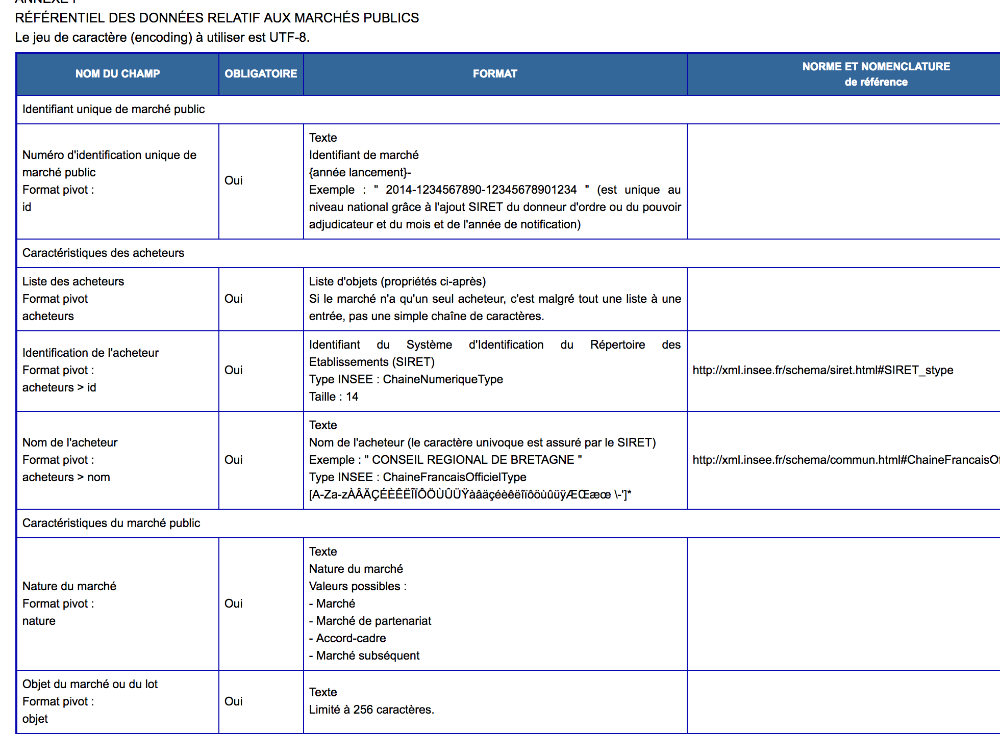

layout: true

`r paste0("
", params$event, " 

")` 

---

class: center, middle

Ces slides en ligne : `r paste0("http://datactivist.coop/", params$slug)`

Sources : `r paste0("https://github.com/datactivist/", params$slug)`

Les productions de Datactivist sont librement réutilisables selon les termes de la licence [Creative Commons 4.0 BY-SA](https://creativecommons.org/licenses/by-sa/4.0/legalcode.fr).

 
 

---

class: inverse, center, middle

### Essential contracting data: DECP ?

---
### Essential contracting data
.pull-left[
- .red[**Ordinance of July 23, 2015**]: requires "public buyers to make public the choice of the selected offer and to make available in an open and freely reusable format the essential data of the public contract."

- The [**Order of April 14, 2017**](https://www.legifrance.gouv.fr/eli/arrete/2017/4/14/ECFM1637256A/jo) specifies the list of data that must be published on buyer profiles as well as the terms of their publication as of October 1, 2018]

.pull-right[

.footnote[[Source](https://www.etalab.gouv.fr/la-transparence-de-la-commande-publique-se-transforme-au-service-de-lopen-data)]
]

---
### What is the content of the data?

---
### An interoperable and unique standard 
.reduite2[]
---
### Data should be published as soon as possible 
.center.reduite[]
---
## When and how?

---
### The Good

* A good volume of data : 240817 marchés sur 2 ans

* A machine-readable and standardised format

* Consolidated data on data.gouv.fr

* Data available as OCDS for analysis and visualisation across a multitude of international tools

---
### The Bad

* Some platforms are still missing

* Some buyers are still missing 

* Many quality issues are ongoing

* A complex procedure to publish 

* JSON and XML make data use complicated 

* Therefore, we lack users and quality issues are not always fixed. 

* Other sources (BOAMP) are still used to complement the data. 

---
### The Ugly 

* The documents are not available: it is difficult to know what has been purchased. The documents of a contract (specifications, offers, text of the contract itself...) are not subject to the publication obligation: how to know precisely what has been purchased?

* Companies do not play the game and try to sell public data

* No unique identifier to track the life of a contract. No phase by phase tracking. 

* Threshold at 40k€

* Health emergency : transparency can be  bypassed

---
# Merci !

Contact : [samuel@datactivist.coop](mailto:samuel@datactivist.coop)

